# NirmaanAI — Unified Factory Data Schema Specification

**Document Version**: 1.0.0  
**Phase**: Phase 4 — Unified Factory Data Schema  
**System**: NirmaanAI Digital Factory Brain  
**Target MSME Verticals**: Textile & Precision Automotive Component Manufacturing  
**Academic Alignment**: IEM Kolkata, Department of CSE (AI), Group 59 | Guide: Prof. Kuntal Mondal  

---

## 1. Executive Summary & Design Philosophy

The **Unified Factory Data Schema** serves as the central data contract for the NirmaanAI platform. In real MSME manufacturing plants, factory data is severely fragmented:
- Machine telemetry exists in local sensor buffers or PLC memory.
- Production schedules exist in manual logbooks or spreadsheets.
- Maintenance records exist in technician repair slips.
- Inventory levels exist in rudimentary accounting packages.
- Financial costs are reviewed monthly in summary MIS reports.

NirmaanAI's schema normalizes and interrelates these disparate dimensions into a unified, queryable relational structure. This design enables the closed-loop intelligence engine to calculate immediate financial impacts (in Indian Rupees) from raw physical sensor events:

$$\text{Physical Telemetry} \longrightarrow \text{Machine Health} \longrightarrow \text{Production Queue} \longrightarrow \text{Downtime Hours} \longrightarrow \text{Financial Rupee Loss}$$

---

## 2. Entity-Relationship (ER) Diagram

```mermaid
erDiagram
    MACHINES ||--o{ SENSOR_READINGS : generates
    MACHINES ||--o{ PRODUCTION_JOBS : executes
    MACHINES ||--o{ MAINTENANCE_RECORDS : undergoes
    MACHINES ||--o{ FACTORY_HEALTH_SNAPSHOTS : evaluated_by
    MACHINES ||--o{ OPERATIONAL_LOSS_RECORDS : incurs

    MACHINES {
        string machine_id PK "Unique machine identifier (e.g., M1, M2)"
        string name "Descriptive name"
        string machine_type "VMC Milling, CNC Lathe, Loom, Grinder"
        string line_id "Production line (e.g., LINE_01)"
        float design_cycle_time_sec "Nominal cycle time in seconds"
        float baseline_power_kw "Nominal power consumption (kW)"
        float baseline_vibration_mms "Normal vibration velocity (mm/s)"
        float alert_vibration_mms "Warning threshold (mm/s)"
        float critical_vibration_mms "Emergency shutdown threshold (mm/s)"
        float rated_capacity_units_per_hour "Nominal output capacity"
        string status "OPERATIONAL, DEGRADED, MAINTENANCE, OFFLINE"
        int installation_year "Commissioning year"
    }

    SENSOR_READINGS {
        int reading_id PK "Auto-incrementing reading ID"
        string machine_id FK "References MACHINES.machine_id"
        datetime timestamp "Observation timestamp UTC"
        float vibration_mms "Measured RMS vibration (mm/s)"
        float temperature_c "Process temperature (Celsius)"
        float ambient_temperature_c "Ambient room temperature (Celsius)"
        float rotational_speed_rpm "Spindle rotational speed"
        float torque_nm "Spindle torque (Nm)"
        float sound_db "Acoustic noise (dB)"
        float power_consumption_kw "Active power (kW)"
        float oil_level_pct "Lubrication oil level (%)"
        float coolant_level_pct "Coolant reservoir level (%)"
        float tool_wear_min "Cumulative tool wear (minutes)"
    }

    PRODUCTION_JOBS {
        string job_id PK "Unique batch job identifier"
        string machine_id FK "References MACHINES.machine_id"
        string operation_type "Milling, Turning, Weaving, Grinding"
        datetime scheduled_start "Planned start time"
        datetime scheduled_end "Planned completion time"
        datetime actual_start "Observed start time"
        datetime actual_end "Observed finish time"
        int batch_quantity "Scheduled unit volume"
        int completed_quantity "Conforming units completed"
        int scrap_quantity "Scrapped units"
        float actual_cycle_time_sec "Observed average cycle time"
        string status "SCHEDULED, RUNNING, COMPLETED, DELAYED, FAILED"
    }

    MAINTENANCE_RECORDS {
        string record_id PK "Unique maintenance log ID"
        string machine_id FK "References MACHINES.machine_id"
        datetime timestamp "Event occurrence timestamp"
        string event_type "PREVENTIVE, UNPLANNED_STOP, BREAKDOWN, TOOL_CHANGE"
        string failure_mode "NONE, TWF, HDF, PWF, OSF, RNF, BEARING_WEAR, OTHER"
        float downtime_minutes "Halted duration in minutes"
        string technician_id "Attending technician ID"
        string corrective_action "Repair or maintenance action performed"
        text notes "Free-text technician notes"
    }

    INVENTORY_ITEMS {
        string item_id PK "Part SKU identifier"
        string item_name "Descriptive component name"
        string category "RAW_MATERIAL, WIP, FINISHED_GOOD, SPARE_PART"
        float current_stock "Stock on hand"
        float safety_stock "Minimum buffer threshold"
        float unit_cost_inr "Unit cost in Indian Rupees"
        float reorder_quantity "Replenishment purchase batch"
        string unit_of_measure "kg, units, meters, liters"
    }

    FINANCIAL_PARAMETERS {
        string config_id PK "Rate profile identifier"
        float downtime_hourly_cost_inr "Hourly downtime loss rate (INR/hr)"
        float base_electricity_rate_inr_per_kwh "Base power tariff (INR/kWh)"
        float peak_electricity_rate_inr_per_kwh "Peak power tariff (INR/kWh)"
        float scrap_cost_rate_inr_per_kg "Scrap cost rate (INR/kg)"
        float rework_hourly_labor_inr "Technician rework labor rate (INR/hr)"
        datetime effective_date "Activation date"
    }

    FACTORY_HEALTH_SNAPSHOTS {
        int snapshot_id PK "Snapshot identifier"
        string machine_id FK "References MACHINES.machine_id"
        datetime timestamp "Assessment timestamp"
        float composite_health_score "Overall Health Score (0-100)"
        float vibration_health "Vibration index (0-100)"
        float temperature_health "Thermal index (0-100)"
        float cycle_efficiency_health "Cycle speed efficiency index (0-100)"
        float maintenance_health "Maintenance wear index (0-100)"
        string health_state "EXCELLENT, GOOD, WARNING, CRITICAL"
        string contributing_anomaly "Primary degradation factor candidate"
    }

    OPERATIONAL_LOSS_RECORDS {
        int loss_id PK "Loss record identifier"
        string machine_id FK "References MACHINES.machine_id"
        datetime timestamp "Loss calculation timestamp"
        float downtime_minutes "Total downtime in minutes"
        float downtime_loss_inr "Quantified downtime overhead loss (INR)"
        float energy_wastage_kwh "Excess energy consumed (kWh)"
        float energy_loss_inr "Excess electricity surcharge (INR)"
        int scrap_quantity "Defective items scrapped"
        float scrap_loss_inr "Material loss in scrap (INR)"
        float rework_hours "Rework technician hours"
        float rework_loss_inr "Rework labor loss (INR)"
        float total_financial_loss_inr "Total composite loss in Indian Rupees"
    }
```

---

## 3. Data Dictionary & Validation Constraints

### 3.1. `machines`
| Field | SQL Type | Constraints | Default | Description |
| :--- | :--- | :--- | :--- | :--- |
| `machine_id` | `VARCHAR(50)` | Primary Key | - | Unique machine asset ID (e.g. `M1`, `M2`, `LOOM_04`) |
| `name` | `VARCHAR(100)` | Not Null | - | Human-readable machine name |
| `machine_type` | `VARCHAR(50)` | Not Null | - | Equipment classification (`VMC Milling`, `CNC Lathe`, `Loom`) |
| `line_id` | `VARCHAR(50)` | Not Null | `'LINE_01'` | Shop floor production line |
| `design_cycle_time_sec` | `FLOAT` | $> 0.0$ | - | Nominal unit manufacturing cycle time |
| `baseline_power_kw` | `FLOAT` | $\ge 0.0$ | - | Rated power consumption |
| `baseline_vibration_mms` | `FLOAT` | $\ge 0.0$ | `1.2` | Normal vibration baseline |
| `alert_vibration_mms` | `FLOAT` | $> 0.0$ | `3.8` | Warning vibration threshold |
| `critical_vibration_mms` | `FLOAT` | `> alert` | `5.5` | Emergency shutdown vibration threshold |
| `status` | `VARCHAR(30)` | Not Null | `'OPERATIONAL'` | `OPERATIONAL`, `DEGRADED`, `MAINTENANCE`, `OFFLINE` |

### 3.2. `sensor_readings`
| Field | SQL Type | Constraints | Description |
| :--- | :--- | :--- | :--- |
| `reading_id` | `INTEGER` | Primary Key, Auto-increment | Sequential telemetry ID |
| `machine_id` | `VARCHAR(50)` | Foreign Key $\to$ `machines.machine_id` | Machine being monitored |
| `timestamp` | `DATETIME` | Not Null, Indexed | UTC timestamp of observation |
| `vibration_mms` | `FLOAT` | $\ge 0.0$ | RMS vibration velocity (mm/s) |
| `temperature_c` | `FLOAT` | Not Null | Process/casing temperature (°C) |
| `ambient_temperature_c` | `FLOAT` | Nullable | Ambient shop-floor temperature (°C) |
| `rotational_speed_rpm` | `FLOAT` | $\ge 0.0$, Nullable | Spindle speed |
| `torque_nm` | `FLOAT` | $\ge 0.0$, Nullable | Spindle torque |
| `sound_db` | `FLOAT` | $\ge 0.0$, Nullable | Acoustic sensor measurement |
| `power_consumption_kw` | `FLOAT` | $\ge 0.0$, Nullable | Active electrical power load |
| `tool_wear_min` | `FLOAT` | $\ge 0.0$, Nullable | Cumulative tool usage time |

*Indexing*: Composite B-Tree index on `(machine_id, timestamp)` for sub-millisecond time-slice retrieval.

---

## 4. Empirical Dataset Mapping to Unified Schema

The Unified Schema is deliberately designed to map cleanly onto each active empirical dataset:

| Empirical Dataset | Source Columns | Target Unified Table & Columns |
| :--- | :--- | :--- |
| **01_AI4I_2020** | `Rotational speed [rpm]`, `Torque [Nm]`, `Air temperature [K]`, `Process temperature [K]`, `Tool wear [min]` | $\to$ `sensor_readings` (`rotational_speed_rpm`, `torque_nm`, `temperature_c`, `tool_wear_min`) |
| **01_AI4I_2020** | `TWF`, `HDF`, `PWF`, `OSF`, `RNF` | $\to$ `maintenance_records` (`failure_mode`) |
| **02_NASA_CMAPSS** | `unit_number`, `time_in_cycles`, sensor readings s1..s21 | $\to$ `sensor_readings` and `factory_health_snapshots` (RUL degradation index) |
| **05_INDUSTRIAL_IOT** | `Vibration_mms`, `Temperature_C`, `Sound_dB`, `Power_Consumption_kW`, `Oil_Level_pct` | $\to$ `sensor_readings` (`vibration_mms`, `temperature_c`, `sound_db`, `power_consumption_kw`, `oil_level_pct`) |
| **06_MANUFACTURING_PRODUCTION** | `Job_ID`, `Machine_ID`, `Scheduled_Start`, `Actual_Start`, `Job_Status` | $\to$ `production_jobs` (`job_id`, `machine_id`, `scheduled_start`, `actual_start`, `status`) |
| **08_MANUFACTURING_DEFECTS** | `ProductionCost`, `DowntimePercentage`, `DefectRate`, `StockoutRate` | $\to$ `operational_loss_records` and `inventory_items` |

---

## 5. Architectural Support for the Machine 2 Scenario

In the Machine 2 use case specified in IEM Group 59's proposal, Machine 2 begins degrading while running a production batch:
1. High-frequency sensor ingestion records an elevation in `sensor_readings.vibration_mms` from $1.4\text{ mm/s}$ past `alert_vibration_mms = 3.8\text{ mm/s}`.
2. The increased vibration and thermal resistance cause `production_jobs.actual_cycle_time_sec` to increase from $45.0\text{ s}$ to $62.0\text{ s}$, creating a queue backlog on Line 1.
3. `factory_health_snapshots` drops `composite_health_score` from $92.0$ to $58.0$ (`WARNING`).
4. `operational_loss_records` estimates the rupee impact using `financial_parameters.downtime_hourly_cost_inr = ₹4,500/hr`:
   $$\text{Projected Downtime} = 2.5\text{ hours} \implies \text{Downtime Loss} = 2.5 \times ₹4,500 = \mathbf{₹11,250}$$
5. The recommendation engine instructs the shop floor manager to pause Machine 2 during the scheduled 14:00 shift changeover for spindle lubrication, preventing a catastrophic breakdown.
